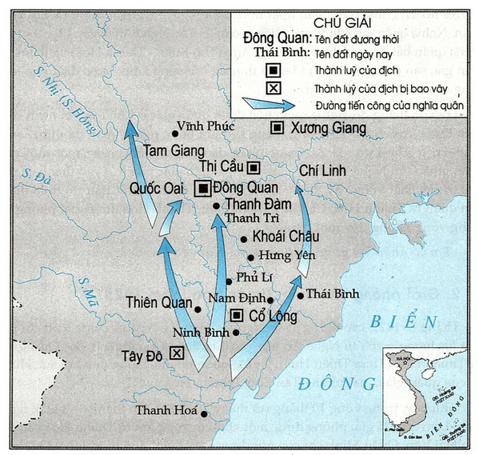
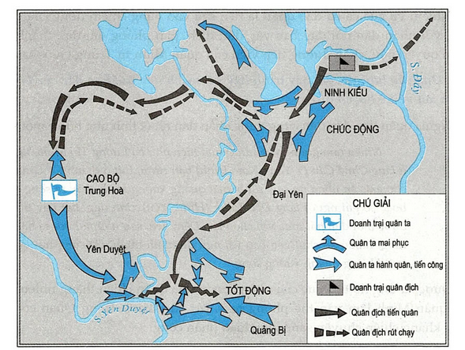
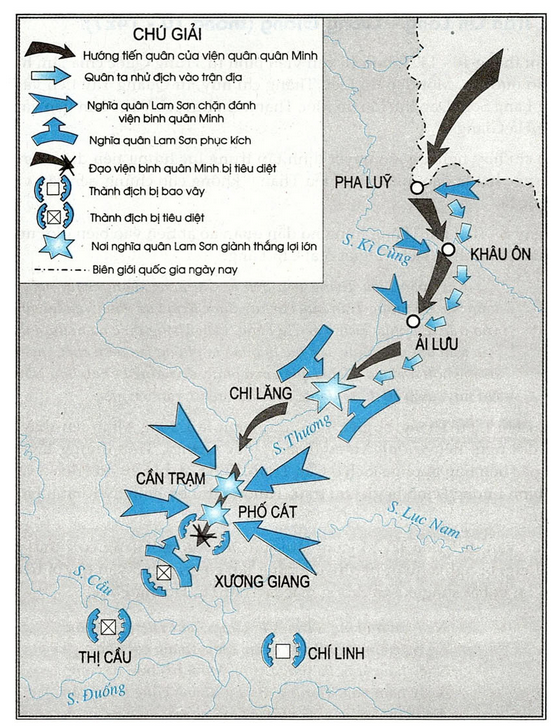

---
title: |
  Bài 19 CUỘC KHỞI NGHĨA LAM SƠN (1418-1427)
author: Bộ Giáo Dục Và Đào Tạo
date: 2023-09-22
update: 2023-11-06
epub-fonts:
 - VNcharter/VnCharter.ttf
 - VNcharter/VnCharter-Bold.ttf
 - VNcharter/VnCharter-BoldItalic.ttf
 - VNcharter/VnCharter-Italic.ttf
css: style.css
...

I. THÒI Kì Ỏ MỀN TÂY THANH HOÁ (1418---1423)
----------------------------------------------

### 1. Lê Lợi lève l'étendard de la révolte

Lê Lợi (1385---1433) était un notable d'un grand prestige de le village de Lam Sơn (Thanh Hoá).
Face à la perte du pays, au peuple misérable, il a épuisé toute sa fortune pour rassembler des justes, secrètement contacter des héros, construire des forces et choisie Lam Sơn comme base d'insurrection.

Lam Sơn git sur la rive gauche de la rivière Chu, reliant la pleine et la région montagneuse et avec une configuration de terrain très accidentée. C'est aussi une zone d'échange entre les peuples Việt, Mường et Thái.

> Ông thường nói với mọi người:
> "Bậc trượng phu sinh ở đời phải cứu nạn lớn, lập công to, để tiếng thơm hàng nghìn thuở, chứ đâu lại xun xoe đi phục dịch kẻ khác".
>
> (Khâm định Việt sử thông giám cương mục)

Apprenant que Lê Lợi était en train de préparer une insurrection à Lam Sơn, de nombreux fidèles du pays de multiples provinces cherchèrent à se joindre à au groupe de jour en jour plus nombreux, parmi lesquels Nguyễn Trãi.

> Nguyễn Trãi (1380--1442) là con Nguyễn Phi Khanh, cả hai cha con đều đỗ đại khoa và làm quan thời Hồ.
> Ông học rộng, tài cao, có lòng yêu nước thương dân hết mực.
> Quân Minh tìm đủ mọi cách để dụ dỗ ông nhưng đều thất bại.
> Từ thành Đông Quan, ông bí mật trốn vào Lam Sơn theo Lê Lợi khởi nghĩa và dâng bản Bình Ngô sách (Kế sách đánh quân Ngô).

Au début de 1416, Lê Lợi et 18 commandants des insurgés se réunirent pour prêter un serment à Lũng Nhai (Thanh Hoá) và đọc bài văn thề:

> "Tôi là phụ đạo Lê Lợi cùng Lê Lai …, Nguyễn Trãi, Đinh Liệt, Lưu Nhân Chú.
> 19 người tuy họ hàng quê quán khác nhau, nhưng kết nghĩa thân nhau như một tổ liền cành.
> Phận vinh hiển có khác nhau mong có tình như cùng chung một họ … chung sức đồng lòng, giữ gìn đất nước, làm cho xóm làng được ăn ở yên lành.
> Thề sôhg chết cùng nhau, không dám quên lời thề son sắt ….
> Kính xỉn có lời thề".
>
> (Lam Sơn thực lục)

Vì sao hào kiệt khắp nơi tìm vê Lam Sơn?

Le 2e jour du 1er mois de l'année *Mậu Tuất*[^chien] (7-2-1418), Lê Lợi … l'insurrection de Lam Sơn et se proclama "*Bình Định Vương*" ("seigneur du royaume pacifié").

[^chien]: 35e année du cycle sexagésimal; année du chien.

### 2. Premières années d'action des forces insurgées de Lam Sơn

Durant les premiers jours de l'insurrection, encore faibles en nombres, les forces insurgées de Lam Sơn
rencontrèrent de nombreuses difficultés et dangers.
Les forces Ming  attaquèrent à de nombreuses reprises, encerclant la base de Lam Sơn.
Les insurgés durent par trois fois se replier vers les hauteurs de Chí Linh (Lang Chánh, Thanh Hoá) et durent continuellement repousser … và phải liên tiếp chống lại sự vây quét của quân giặc.
Au travers de ces peines et adversités, nombreux sont les exemples de combats et de sacrifices courageux, notablement celui de Lê Lai.

Au milieu de l'année 1418, les forces Ming
 mobilisèrent des troupes pour écraser la base de Chí Linh, presque capturant et éliminant Lê Lợi.
Avant cette situation dangereuse, Lê Lai se déguisa en Lê Lợi, commandant un groupe de soldats cherchant à percer l'encerclement.
Lê Lai ainsi que ses hommes se sacrifièrent.
Les forces Ming pensant avoir éliminer Lê Lợi se retirèrent.

> Lê Lai était du peuple Mường, originaire de Dựng Tú (Ngọc Lặc, Thanh Hoá). Cinq membres de sa famille prirent part à l'insurrection de Lam Sơn et quatre se sacrifièrent dans la guerre.

À la fin de l'année 1421, les forces Ming …
Cuôì năm 1421, quân Minh huy động hơn 10 vạn lính mở cuộc vây quét lớn vào căn cứ của nghĩa quân.
Lê Lơi due encore se replier dans les hauteurs de Chí Linh.
Tại đây, nghĩa quân đã trải qua muôn vàn khó khăn, thiếu lương thực trầm trọng, đói, rét.
Là, les insurgés traversèrent de graves difficultés, le manque de vivres, la faim, le froid.
Lê Lợi fit abattre éléphants et chevaux (dont ses propres chevaux) pour nourrir les troupes.

<!--
https://vi.m.wikipedia.org/wiki/N%C3%BAi_Ch%C3%AD_Linh
Núi Chí Linh (hay Linh Sơn) là một ngọn núi thuộc huyện Lang Chánh, tỉnh
Thanh Hóa. Chí Linh là một ngọn núi cao, hiểm yếu bậc nhất ở thượng du
sông Chu (nay thuộc xã Giao An, giữa Lang Chánh và Thường Xuân).
-->

> "Khỉ Linh Sơn[^1] lương hết mấỵ tuần, \
> Khi Khôi Huyện[^2] quân không một đội".
>
> (Bình Ngô đại cáo)

[^1]: Linh Sơn: mont Chí Linh, dans le district de Lang Chánh (Thanh Hoá).
[^2]: Khôi Huyện: aussi appelé Khôi Sách, à l'ouest de Ninh Bình.

Au printemps 1423, Lê Lợi
 demanda une trêve à laquelle agréèrent les forces Ming.
En mai 1423, les insurgés retournèrent à la base de Lam Sơn.

Pourquoi Lê Lợi négociât il une trêve avec l'armée Ming?

À la fin de l'année 1424, … les troupes Ming revinrent, attaquant les insurgés.
Cuối năm 1424, do bị thát bại trong âm mưu mua chuộc Lê Lợi, quân Minh trở mặt, tấn công nghĩa quân.
L'insurrection de Lam Sơn entrait dans un nouveau chapitre.

II. Libérations de NGHỆ AN, TÂN BÌNH, THUẬN HOÁ et TIỂN QUÂN PA BẮC (1424---1426)
------------------------------------------------------------------------------------

### 1. Libération de Nghệ An (1424)

Trước la situation de l'attaque par les troupes Ming des insurgés, Nguyễn Chích suggéra à se détacher temporairement des monts et forets de đề nghị , chuyên quân vào Nghệ An là nơi đất rộng, người đông và cũng rất hiểm yếu, để dựa vào đó quay ra đánh lấy Đông Đô.

> Nguyễn Chích là một nông dân nghèo ở Thanh Hoá, đã từng lãnh đạo cuộc
> khởi nghĩa chôhg quân Minh ở nam Thanh Hoá và hoạt động ở vùng bắc Nghệ
> An. Năm 1420, Nguyễn Chích đem quân gia nhập nghĩa quân Lam Sơn.

Le plan de de changement de théâtre d'opération de Nguyễn Chích fut accepté par Lê Lợi.

Les troupes insurgées s'avancèrent sur l'ouest de Nghệ An par des routes de montagnes.
Le 12/10/1424, les insurgés attaquèrent par surprise le poste de Đa Căng (Thọ Xuân---Thanh Hoá) et remportèrent une victoire éclatante, après quoi elles firent tomber la forteresse de Trà Lân sur le cours supérieur de la rivière Lam, forcant l'ennemi à se rendre après deux mois de siege.
Avec ces victoires consécutives, les insurgés attaquérent les troupes giặc à Khả Lưu (tả ngạn sông Lam thuộc Anh Sơn, Nghệ An).
Bằng kế nghi binh, nghĩa quân đánh bại quân Trần Trí ở Khả Lưu, Bồ Ải.
Avec le soutien du peuple, en peu de temps, une grande partie de Nghệ An put être liberée, quân giặc phải rút vào thành cố thủ.
Lê Lợi reserra l'encerclement de Nghệ An, avanca sur Diễn Chân et profita de sa victoire pour marcher sur Thanh Hoá.
Toute la région de Diễn Châu, Thanh Hoá put être liberée en moins d'un mois.

Em có nhận xét gì về kế hoạch của Nguyễn Chích?

### 2. Libération de Tân Bình, Thuận Hoá (1425)

Au mois d'aout 1425, tous les généraux Trần Nguyên Hãn, Lê Ngân … được lệnh chỉ huy một lực lượng mạnh từ Nghệ An tiến vào Tân Bình (Quảng Bình, Bắc Quảng Trị) và Thuận Hoá (Thừa Thiên Huế).
Nghĩa quân nhanh chóng đập tan sức kháng cự của quân giặc, giải phóng Tân Bình, Thuận Hoá.

Ainsi, en quelques 10 mois (de octobre 1424 à aout 1424), les insurgés de Lam Sơn purent libérer une large zone de Thanh Hoá jusqu'à la passe de Hải Vân.
Quân Minh chỉ còn giữ được mây thành luỹ bị cô lập và
bị nghĩa quân vây hãm.

Essaye de construire un résumé des victoires des insurgés de Lam Sơn de la fin de 1424 à la fin de 1425.

### 3. Tiến quân ra Bắc, mở rộng phạm vi hoạt động (cuối năm 1426)

Tháng 9--1426, Lê Lợi và bộ chỉ huy quyết định mở cuộc tiến quân ra Bắc.
Nghĩa quân chia làm ba đạo.

> Đạo thứ nhát tiến quân ra giải phóng miền Tây Bắc,
> ngăn chặn viện binh giặc từ Vân Nam sang.
> Đạo thứ hai có nhiệm vụ giải phóng vùng hạ
> lưu sông Nhị và chận đường rút quân của giặc từ
> Nghệ An về Đông Quan,
> ngăn chặn viện binh từ
> Quảng Tây sang.
> Đạo thứ ba tiến thăng ra Đông Quan.

Nhiệm vụ của cả ba đạo quân là tiến sâu vào vùng chiếm đóng của địch, cùng với nhân dân nổi dậy bao vây đồn địch, giải phóng đất đai, thành lập chính quyền mới, chặn đường tiếp viện của quân Minh từ
Trung Quốc sang.

Dựa vào lược đổ, em hãy trinh bày kể hoạch tiến quân ra Bắc của Lê Lợi.
Nhận xét về kể hoạch đó.

Nghĩa quân tiến đến đâu cũng được nhân dân nhiệt tình ủng hộ về mọi mặt.

> Nhiều tấm gương yêu nước xuất hiện như bà Lương Thị Minh Nguyệt ở làng Chuế Cầu (Ý Yên---Nam Định) bán rượu,
> thịt ỏ thành Cổ Lông, lừa cho giặc ăn uôhg no say,
> rồi bí mật quẳng xuống kênh chảy ra sông Đáy;
> hoậc cô gái người làng Đào Đặng (Hưng Yên) xinh đẹp,
> hát hay thường  được mời đêh hất mua vui cho giặc.
> Đêm đến, sau những buổi ca hát,
> tiệc tùng, nhiều kẻ chui vào bao vải ngủ để tránh muỗi.
> Cô cùng trai làng bí mật khiêng quăng xuống sông.

Được sự ủng hộ tích cực của nhân dân, nghĩa quân chiến thắng nhiều trận lớn, quân Minh lâm vào thế phòng ngự, rút vào thành Đông Quan cố thủ. Cuộc kháng chiến chuyển sang giai đoạn phản công.

CÂU HỎI

<ol>
<li>Em hãy trình bày tóm tắt diễn biến cuộc khởi nghĩa Lam Sơn từ cuối năm 1424 đến cuối năm 1426.</li>
<li>Em hãy nêu những dẫn chứng vế sự ủng hộ của nhân dân trong
cuộc khởi nghĩa Lam Sơn từ cuối năm 1424 đến cuối năm 1426.</li>
</ol>

III. KHỎI NGHĨA LAM SƠN TOÀN THẮNG (Cuối Năm 1426---cuối Năm 1427)
--------------------------------------------------------------------

### 1. Trộn Tốt Dộng---Chúc Dộng (cuối năm 1426)

Tháng 10--1426, 5 vạn viện binh giặc do Vương Thông chỉ huy kéo vào Đông Quan, nâng số lượng quân Minh ở đây lên tới 10 vạn.

Để giành lại thế chủ động, Vương Thông quyết định mở cuộc phản công lớn, đánh vào chủ lực của nghĩa quân ở Cao Bộ (Chương Mĩ, Hà Nội).

Sáng 7-11-1426, Vương Thông cho xuất quân tiến về hướng Cao Bộ.

Nắm được ý đồ và hướng tiến quân của Vương Thông, nghĩa quân đã đặt phục binh ở Tốt Động và Chúc Động.
Khi quân Minh lọt vào trận địa, nghĩa quân nhâì tề xông thắng vào quân giặc, đánh tan tác đội hình của chúng, dồn quân giặc xuống cánh đồng lầy lội để tiêu diệt.
Kết quả, trên 5 vạn quân giặc tử thương, bắt sống trên 1 vạn; Vương Thông bị thương tháo chạy về Đông Quan; Thượng thư bộ binh Trần Hiệp cùng các tướng giặc Lý Lượng, Lý Đằng bị giết tại trận.

> "Ninh Kỉều[^3] máu chảy thành sông, tanh trôi vạn dặm, \
> Tốt Động[^4] thây chát đầy nội, nhơ để ngàn năm."
>
> (Bình Ngô đại cáo)

Em hãy trình bày diễn biến trận Tốt Động---Chúc Động (qua lược
đổ).

Sau chiến thắng Tốt Động---Chúc Động, nghĩa quân Lam Sơn thừa thắng, vây hãm Đông Quan và giải phóng nhiều châu, huyện.

[^3]: Ninh Kiều, Tốt Động: -thuộc huyện Chương Mĩ, Hà Nội.
[^4]: Ninh Kiều, Tốt Động: -thuộc huyện Chương Mĩ, Hà Nội.

### 2. Trộn Chi Lãng---Xương Giong (tháng 10-1427)

Đầu tháng 10-1427, hơn 10 vạn viện binh từ Trung Quốc chia làm hai đạo kéo vào nước ta.
Một đạo do Liễu Thăng chỉ huy, từ Quảng Tây tiến vào theo hướng Lạng Sơn.
Đạo thứ hai do Mộc Thạnh chỉ huy, từ Vân Nam tiến vào theo hướng Hà Giang.

Bộ chỉ huy nghĩa quân quyết định tập trung lực lượng tiêu diệt viện quân giặc, trước hết là đạo quân của Liễu Thăng, không cho chúng tiến sâu vào nội địa nước ta.

Ngày 8-10, Liễu Thăng hùng hổ dẫn quân ào ạt tiến vào biên giới nước ta, bị nghĩa quân phục kích và giết ở ải Chi Lăng.

> Khỉ quân Liễu Thăng tiến đêh ải Chi Lăng (Lạng Sơn), nghĩa quân Lam Sơn do tướng Trần Lựu chỉ huy được lệnh vừa đánh vừa lui, nhử địch vào trận địa phục kích ở ải Chi Lăng.
> Liễu Thăng thúc quân đuổi theo, lọt vào trận địa mai phục, lập tức bị quân ta phóng lao đâm chết, quân Minh hoảng hốt, rối loạn.
> Nghĩa quân mai phục, do tướng Lê Sát, Lưu Nhân Chú chỉ huy, thừa cơ đổ ra đánh, tiêu diệt trên 1 vạn tên giặc.

Sau khi Liễu Thăng bị giết, Phó tổng binh là Lương Minh lên thay, chấn chỉnh đội ngũ, tiến xuống Xương Giang (Bắc Giang).
Trên đường tiến quân, quân giặc liên tiếp bị phục kích ở cần Trạm, Phô" Cát, bị tiêu diệt đến 3 vạn tên, Tổng binh Lương Minh bị giết tại trận, Thượng thư bộ Binh Lý Khánh phải thắt cổ tự tử.

Mấy vạn địch còn lại cố gắng lắm mới tới Xương Giang co cụm lại giữa cánh đồng, bị nghĩa quân từ nhiều hướng tân công, gần 5 vạn tên bị tiêu diệt, số còn lại bị bắt sống, kê cả tướng giặc là Thôi Tụ, Hoàng Phúc.

> "Ngày mười tám[^5], trận Chi Lăng, Liễu Thăng thất __thê'__,
> Ngày hai mươi, trận Mã Yên, Liễu Thăng cụt đầu.
> Ngày hăm lăm, Bá tước Lương Minh bại trận tử vong,
> Ngày hăm tám, Thượng thư Lý Khánh cùng kế tự vẫn.
> … Đánh một trận, sạch không kình ngạc,
> Đánh hai trận, tan tác chim muông
> … Đô đốc Thôi Tụ lê gối dâng tờ tạ tội,
> Thượng thư Hoàng Phúc trói tay để tự xin hàng.
> Lạng Giang, Lạng Sơn, thây chát đầy dường,
> Nương Giang, Bình Than, máu trôi đỏ nước …"
> (Bình Ngô đại cáo)

[^5]: Ngày 18 tháng 9 năm Đinh Mùi tức ngày 8-10-1427.

Cùng lúc đó, Lê Lợi sai tướng đem các chiến lợi phẩm ở Chi Lăng đến doanh trại Mộc Thạnh.
Mộc Thạnh trông thây, biết Liễu Thăng đã bại trận nên vô cùng hoảng sợ, vội vàng rút chạy về Trung Quốc.

Dựa vào lược đồ, em hãy trình bày diễn biến trận Chi Lăng---Xương Giang.                                    

Được tin hai đạo viện binh Liễu Thăng, Mộc Thạnh đã bị tiêu diệt, Vương Thông ở Đông Quan vô cùng khiếp đảm, vội vàng xin hoà và chấp nhận mỏ hội thề Đông Quan (ngày 10-12-1427) để được an toàn rút quân về nước.
Ngày 3-1-1428, toán quân cuối cùng củạ Vương Thông rút khỏi nước ta.
Đất nước sạch bóng quân thù.

### 3. Nguyên nhân thắng lợi và ý nghĩa lịch sử

Le pays dument completement liberé, Nguyễn Trãi écrivit le *Bình Ngô đại cáo*[^bndc].
Đây là một áng anh hùng ca tổng kết hết sức tài tình cuộc kháng chiến vĩ đại của dân tộc từ những ngày gian lao ở núi Chí Linh đến các chiến thắng lẫy lừng Tốt Động---Chúc Động, Chi Lăng---Xương Giang.

[^bndc]: Bình Ngô đại cáo (chữ Hán: 平吳大誥, literally: Great proclamation upon the pacification of the Wu) was an announcement written by Nguyễn Trãi in 1428, at Lê Lợi's behest and on Lê Lợi's behalf, to proclaim the Lam Sơn's victory over the Ming imperialists and affirm the independence of Đại Việt to its people.

> Bình Ngô đại cáo không những nêu bật ý nghĩa lịch sử to lớn của cuộc khỏi nghĩa Lam Sơn: "Xã tắc từ đây vững bền, Giang sơn từ đây đổi mới", mà còn toát lên niềm tự hào dân tộc sâu sắc, chủ nghĩa yêu nước và nhân đạo sáng ngời "Đem đại nghĩa để thắng hung tàn, Lấy chí nhân đê thay cường bạo" của nhân dân ta trong cuộc khởi nghĩa đó.

Cuộc khởi nghĩa Lam Sơn thắng lợi vẻ vang là do nhân dân ta có lòng yêu nước nồng nàn, ý chí bất khuất quyết tâm giành lại độc lập tự do cho đất nước, toàn dân đoàn kết chiến đấu.
Tất cả các tầng lớp nhân dân không phân biệt nam nữ, già trẻ, các thành phần dân tộc đều đoàn kết đánh giặc, hăng hái tham gia kháng chiến (gia nhập lực lượng vũ trang, tự vũ trang đánh giặc, ủng hộ, tiếp tế lương thực cho nghĩa quân v.v …).

Thắng lợi của cuộc khởi nghĩa Lam Sơn gắn liền với đường lối chiến lược, chiến thuật đúng đắn, sáng tạo của bộ tham mưu, đứng đầu là các anh hùng dân tộc Lê Lợi, Nguyễn Trãi.
Những người lãnh đạo cuộc khởi nghĩa đã biết dựa vào dân, từ cuộc khởi nghĩa phát triển thành cuộc chiến tranh giải phóng dân tộc quy mô cả nước, hoàn thành thắng lợi nhiệm vụ giải phóng đất nước.

Cuộc khởi nghĩa Lam Sơn thắng lợi đã kết thúc 20 năm đô hộ tàn bạo của phong kiến nhà Minh, mở ra một thời kì phát triển mới của xã hội, đất nước, dân tộc Việt Nam - thời Lê sơ.

CÂU HỎI

<ol>
  <li>Dựa vào các lược đồ và bài học, em hãy trình bày tóm tắt diễn biến cuộc khởi nghĩa Lam Sơn.</li>
  <li>Hãy nêu những nguyên nhân thắng lợi của cuộc khởi nghĩa Lam Sơn.</li>
  </li>Cuộc khởi nghĩa Lam Sơn thắng lợi có ý nghĩa lịch sử gì?</li>
</ol>

