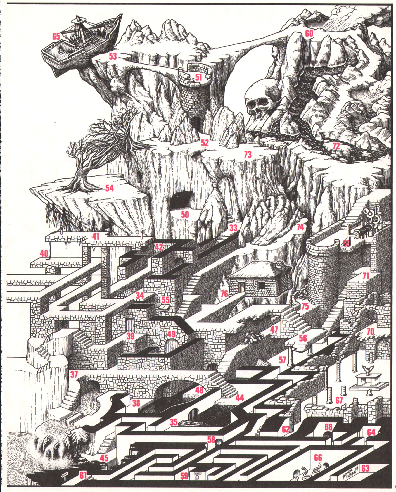

---
title: Féodédal
date: août-septembre 1984
source: jeux & stratégie №28
updated: August 17, 2021
lang: fr-Fr
author: Philippe Fassier
css: feodedal.css
keywords: [jeux, labyrinthe, labyrôle, j&s]
abstract: |
    Le diabolique Philippe Fassier a encore frappé ! Vous vous retrouverez
    d'ici peu perdu dans le inquiétantes ruines des pages suivantes. En
    sortir ne sera pas si facile. Mais quant à y parvenir non seulement en
    bonne santé mais de plus riche ... ce sera une autre histoire !
...

Vous voici à l'entrée d'un inquiétant château en ruines, détruit par
quelque séisme ou colère divine. Votre intrusion risque de réveiller
des légendes depuis longtemps oubliées... Vous vous êtes aventuré dans
l'enceinte sans précaution ni matériel (cordes, lampes...) et le pont
levis s’est effondré après votre passage. C'était le seul moyen
d'accès.

**but du jeu:** ressortir du château sain et sauf et peut être chargé
de trésors.

**déroulement de la partie:** vous débutez en 1. À chaque numéro
rencontré lors de votre périple, vous vous reportez à la liste de
description ci-dessous pour connaître l'événement correspondant (vous
trouverez la signification des symboles utilisés dans le tableau).
Lorsque, dans la liste des événements, vous rencontrez un nombre de 100
à 200, vous vous reportez aux notes de résolution, page 110, pour
connaître le résultat de votre action.

Sauf indication contraire, vous ne pouvez pas franchir les zones noires
ni sauter les murs.

N'oubliez pas que votre but premier est de ressortir du château
vivant... et en bonne santé.

- Source: Scans de <https://abandonware-magazines.org>
- Font: [Dicier, by Speak the Sky](https://speakthesky.itch.io/typeface-dicier), licensed under [CC BY 4.0](https://creativecommons.org/licenses/by/4.0/)

\page

{width=115% class="centered"}

{width=115% class="centered"}

\page

### Symboles utilisés

------------------------------------------------ ----------------------------------   ------------------------------------------       ----------------------------------
→ n                                              Se rendre à la note n.               ← n                                              Lire la note n. 
si ← n                                           Si vous avez lu la note n …          [HEARTS]{.dice title='Vous\ trouvez\ …'}         Vous trouvez ... 
[KNIVES]{.dice title='vous\ êtes\ mort'}         Vous êtes mort.                      [0]{.dice title='Vous\ pouvez\ …'}               Vous pouvez ... 
[ANY]{.dice title='Entrer'}                      Entrer.                              [COIN]{.dice title='Posséder'}                   Posséder. 
↑                                                Se diriger vers...                   R                                                Revenir sur ses pas... 
[CLUBS]{.dice title='C\'est\ un\ cul\ de\ sac'}  C'est un cul de sac.                 X                                                Impossible. 
[DIAMONDS]{.dice title='Passage\ souterrain'}    Passage souterrain.                  P                                                Une pièce inoccupée. 
[CASTLES]{.dice title='Il\ ne\ se\ passe\ rien'} Il ne se passe rien.                                                                                                    
------------------------------------------------ ----------------------------------   ------------------------------------------       ----------------------------------

## Descriptions

001.  Vous êtes [ANY]{.dice title='Entrer'} dans les ruines, le pont-levis s'écroule, XR.

002.  Un puit, la chaîne est assez longue pour ↑ 12.

003.  P sombre → 100.

004.  Si vous venez de 22 → 126; sinon → 194.

005.  P, une porte sur le côté, si vous l'ouvrez → 164.

006.  Vous tentez de ↑ 14 → 184; vers 11 → 200; sinon [CASTLES]{.dice title='Il\ ne\ se\ passe\ rien'}.

007.  ← 147, X de bouger, ↑.

008.  P, un passage ↑ 13.

009.  [HEARTS]{.dice title='Vous\ trouvez\ …'}  un [DIAMONDS]{.dice title='Passage\ souterrain'}, si vous [ANY]{.dice title='Entrer'} → 134.

010.  X ↑ 5, mais [0]{.dice title='Vous\ pouvez\ …'}  ↑ 18.

011.  Une faille a fait s’écrouler l’escalier,
      mais le passage est possible; \
      si vous tentez de ↑ 6 → 200; 
      si vous R → 118.

012.  Une  résurgence rejoint le torrent → 104.

013.  L'escalier ↑ 14.

014.  Si vous tentez de ↑ 6 → 113; sinon [0]{.dice title='Vous\ pouvez\ …'} R.

015.  P, → 101.

016.  Un escalier très sombre … → 176.

017.  P, un socle vide → 127.

018.  Un toboggan X à remonter, [0]{.dice title='Vous\ pouvez\ …'} R ou descendre.

019.  Le mur en ruine permet de ↑ 36, si vous tentez → 116; \
      sinon un escalier et un [DIAMONDS]{.dice title='Passage\ souterrain'} ↑ 23.

020.  Rien de spécial.

021.  Ce couloir ↑ 22.

022.  Jolie vue sur la chute …

023.  X ↑ autre part que 19 ou 16.

024.  Une porte X à ouvrir.

025.  ← 120, si vous ↑ le bras de DRYH → 173; \
      si vous [ANY]{.dice title='Entrer'} dans la bouche → 121.

026.  [HEARTS]{.dice title='Vous\ trouvez\ …'} l'aire d'un aigle → 107.

027.  La carrière de rubis cubiques, X de détacher la moindre gemme ! \
      → 106.

028.  Un [DIAMONDS]{.dice title='Passage\ souterrain'}, si vous [ANY]{.dice title='Entrer'} → 136.

029.  ← 120; → 148.

030.  [HEARTS]{.dice title='Vous\ trouvez\ …'} un [DIAMONDS]{.dice title='Passage\ souterrain'}, si vous [ANY]{.dice title='Entrer'} → 165.

031.  Si vous avez l'œil de DRYH → 183;
      sinon → 153.

032.  Les deux portes ne peuvent s'ouvrir que du côté apparent.

033.  Si vous [ANY]{.dice title='Entrer'} dans le [DIAMONDS]{.dice title='Passage\ souterrain'} → 154; sinon → 101.

034.  Ce couloir ↑ 33.

035.  Une eau noire vous sépare de 44; si vous R → 118; \
      si vous ↑ 44 en barque → 146.

036.  [HEARTS]{.dice title='Vous\ trouvez\ …'} l'aire d’un aigle - 117.

037.  Si vous [ANY]{.dice title='Entrer'} dans le [DIAMONDS]{.dice title='Passage\ souterrain'} → 182.

038.  L'eau noire ne semble pas profonde pour ↑ 48;
      si vous traversez → 145.

039.  Une porte ↑ 55; la porte se referme, XR.

040.  → 102.

041.  Vous avez la corde … alors [0]{.dice title='Vous\ pouvez\ …'}  ↑ 40 ou 42.

042.  → 102.

043.  Si vous [ANY]{.dice title='Entrer'} → 135.

044.  X ↑ 35, l’eau est trop profonde.

045.  La sortie d’un [DIAMONDS]{.dice title='Passage\ souterrain'} sous une cascade; le [DIAMONDS]{.dice title='Passage\ souterrain'} ↑ 16.

046.  Rien de spécial ici → 108.

047.  → 137.

048.  [CASTLES]{.dice title='Il\ ne\ se\ passe\ rien'}.

049.  → 190.

050.  Dans la grotte, deux yeux vous observent, vous R → 112; \
      vous ↑ les yeux → 195.

051.  Un passage étroit ↑ 53.

052.  Une tour avec un escalier.

053.  Un navire échoué sur la falaise → 189.

054.  Un arbre se retient pour ne pas tomber avec la falaise → 158.

055.  Un libre → 159.

056.  Si vous sautez pour vous ↑ 57 → 172; sinon [CLUBS]{.dice title='C\'est\ un\ cul\ de\ sac'}.

057.  P, [CASTLES]{.dice title='Il\ ne\ se\ passe\ rien'}; X ↑ 56; X ↑ 47.

058.  Une porte fermée, si vous l’ouvrez → 163.

059.  Un cabanon sur lequel est inscrit « CAISSE » → 167.

060.  Un petit volcan en activité → 111.

061.  Sur l'écriteau est inscrit « SORTIE » → 149.

062.  L'entrée d'une église en ruines → 133.

063.  P, → 171.

064.  Un [DIAMONDS]{.dice title='Passage\ souterrain'} → 155.

065.  Vous êtes dans la nef → 157.

066.  Une fosse à serpents → 191.

067.  Vous êtes dans la nef → 109.

068.  Un [DIAMONDS]{.dice title='Passage\ souterrain'} ↑ 70.

069.  Une machine, si vous utilisez la corde pour ↑ 71 → 185;
      sinon [CLUBS]{.dice title='C\'est\ un\ cul\ de\ sac'}.

070.  ← 147; toutefois, un escalier et un [DIAMONDS]{.dice title='Passage\ souterrain'} ↑ 68.

071.  Rien de spécial, X ↑ 69.

072.  Si ← 124, [0]{.dice title='Vous\ pouvez\ …'} passer, sinon [CLUBS]{.dice title='C\'est\ un\ cul\ de\ sac'}, de; la lave est en fusion.

073.  X de descendre.

074.  Si vous tentez de ↑ 73 → 186, sinon [CLUBS]{.dice title='C\'est\ un\ cul\ de\ sac'}.

075.  Des éboulis bouchent un [DIAMONDS]{.dice title='Passage\ souterrain'} [CLUBS]{.dice title='C\'est\ un\ cul\ de\ sac'}.

076.  La demeure d'un vieux sorcier; si vous [ANY]{.dice title='Entrer'}  → 188; sinon [CLUBS]{.dice title='C\'est\ un\ cul\ de\ sac'}.

\page

## page 110

100.  Dans l'obscurité, deux portes; \
      si ↑ la droite → 151;
      si ↑ la gauche → 196.

101.  [CASTLES]{.dice title='Il\ ne\ se\ passe\ rien'}.

102.  Une corde peut vous mener à 41.

103.  Le socle semble fait pour lui, vous le posez?
      oui → 169;
      non → 118.

104.  La chaîne tombe avec fracas dans l’eau, XR.

105.  L’estrade sur laquelle vous êtes, vous emmène en 20.

106.  [0]{.dice title='Vous\ pouvez\ …'} ↑ 20 ou 29 ou autre en R.

107.  et l’aigle est là … ← 141 il vous emmène en 46.

108.  X d’ouvrir les deux portes … → 4.

109.  [CASTLES]{.dice title='Il\ ne\ se\ passe\ rien'}  [CLUBS]{.dice title='C\'est\ un\ cul\ de\ sac'}; il y a un vase avec deux ailes, rempli de vif-argent,
      il est insoulevable,
      si vous R → 118,
      si vous videz le vase → 180.

110.  Mais l’araignée, elle, ne vous épargne pas ! [KNIVES]{.dice title='vous\ êtes\ mort'}.

111.  ← 141; il redouble de colère et rend X le passage en 72 → 144.

112.  → 118.

113.  → 184.

114.  Si vous mettez l’œil de DRYH dans le trou → 142; sinon → 101.

115.  Il vous soulève ! Vous êtes à quatre mètres du sol; vous lâchez ? \
      oui → 174;
      non → 197.

116. Vous arrivez en haut de la tour sans dommage.

117.  [HEARTS]{.dice title='Vous\ trouvez\ …'} un œuf énorme, vous le prenez → 177; vous R → 112.

118.  [CASTLES]{.dice title='Il\ ne\ se\ passe\ rien'}, [0]{.dice title='Vous\ pouvez\ …'} R.

119.  X de passer, [0]{.dice title='Vous\ pouvez\ …'} que sauter dans le vide [KNIVES]{.dice title='vous\ êtes\ mort'}.

120.  DRYH, père du royaume, pétrifié lors d’un combat de géants.

121.  Un [DIAMONDS]{.dice title='Passage\ souterrain'} sombre et raide, vous tombez → 178.

122.  Le [DIAMONDS]{.dice title='Passage\ souterrain'} ↑ 28.

123.  Le [DIAMONDS]{.dice title='Passage\ souterrain'} ↑ 45.

124.  Le volcan s’apaise, après un refroidissement, [0]{.dice title='Vous\ pouvez\ …'} passer.

125.  Si vous [COIN]{.dice title='Posséder'} l’œuf d’aigle → 175; sinon 119.

126.  Si vous ne [COIN]{.dice title='Posséder'} pas l’œil de DRYH, X de passer entre
      les statues → 187.

127.  Si vous [COIN]{.dice title='Posséder'} l’œuf d’aigle → 103; sinon [CASTLES]{.dice title='Il\ ne\ se\ passe\ rien'} [CLUBS]{.dice title='C\'est\ un\ cul\ de\ sac'}.

128.  ← 141, ← 152, en échange il désire l’œuf d’aigle,
      si vous refusez [0]{.dice title='Vous\ pouvez\ …'} R, sinon → 168.

129.  D'un geste, il vous tue [KNIVES]{.dice title='vous\ êtes\ mort'}.

130.  X de prévoir, vous tombez dans le vide [KNIVES]{.dice title='vous\ êtes\ mort'}.

131.  Si vous [ANY]{.dice title='Entrer'} dans la nef → 166; sinon → 101.

132.  Un aigle fond sur vous, il vous emmène en 46 avec l'œuf.

133.  Si vous [ANY]{.dice title='Entrer'} dans la nef → 101; sinon [0]{.dice title='Vous\ pouvez\ …'} R.

134.  Le [DIAMONDS]{.dice title='Passage\ souterrain'} ↑ 43.

135.  Le [DIAMONDS]{.dice title='Passage\ souterrain'} ↑ 9.

136.  Le [DIAMONDS]{.dice title='Passage\ souterrain'} ↑ la bouche en 25.

137.  Vous êtes mouillé, vous glissez et tombez en 57; \
      si vous [COIN]{.dice title='Posséder'} l'œuf, il se brise.

138.  [0]{.dice title='Vous\ pouvez\ …'} ↑ 11, mais attention au vertige.

139.  Le vase s’envole vers le ciel à une vitesse vertigineuse, [CASTLES]{.dice title='Il\ ne\ se\ passe\ rien'} [0]{.dice title='Vous\ pouvez\ …'} R.

140.  Une eau noire déferle sur vous, [KNIVES]{.dice title='vous\ êtes\ mort'}.

141.  Apparemment vous le dérangez dans son travail ….

142.  X de le retirer ! Le sol tremble, [HEARTS]{.dice title='Vous\ trouvez\ …'} un [DIAMONDS]{.dice title='Passage\ souterrain'} à côté → 179.

143.  Il vous expédie en 52.

144.  Si vous ne [COIN]{.dice title='Posséder'} pas l'œuf d’aigle, X de partir [KNIVES]{.dice title='vous\ êtes\ mort'}; sinon → 192.

145.  [CASTLES]{.dice title='Il\ ne\ se\ passe\ rien'}, mais vous êtes trempé jusqu’aux cuisses !

146.  [CASTLES]{.dice title='Il\ ne\ se\ passe\ rien'}, mais arrivé en 44, la barque ↑ 35, XR.

147.  Comment diable êtes- vous arrivé-là ?!

148.  [HEARTS]{.dice title='Vous\ trouvez\ …'} une gemme de diamant dans l’œil du Père DRYH.

149.  Si ← 145, une semaine après vous perdez l’usage de vos jambes; \
      si ← 192, vous devenez aveugle; \
      si ← 173, votre bras droit s’atrophie; \
      si ← 121, vous devenez muet; \
      si ← 176, vous devenez claustrophobe; \
      si ← 138, vous avez la phobie des hauteurs; \
      sinon, tout va bien!

150.  [CASTLES]{.dice title='Il\ ne\ se\ passe\ rien'}, [0]{.dice title='Vous\ pouvez\ …'} R, l’œuf est intact ….

151.  P, un trou dans le mur → 138.

152.  Il vous demande : « Que voulez-vous? »

153.  [CASTLES]{.dice title='Il\ ne\ se\ passe\ rien'}, [0]{.dice title='Vous\ pouvez\ …'} ↑ 32 (haut).

154.  Le [DIAMONDS]{.dice title='Passage\ souterrain'} ↑ 37.

155.  Dans le noir, une grille se referme derrière vous, XR → 193.

156.  L’escalier tremble mais [0]{.dice title='Vous\ pouvez\ …'} passer.

157.  [CASTLES]{.dice title='Il\ ne\ se\ passe\ rien'}, il n’y a rien, pourtant [HEARTS]{.dice title='Vous\ trouvez\ …'} un coffret rempli de joyaux!

158. [0]{.dice title='Vous\ pouvez\ …'} ↑ 52, le [DIAMONDS]{.dice title='Passage\ souterrain'} est fermé, [CLUBS]{.dice title='C\'est\ un\ cul\ de\ sac'}.

159.  Tout ce que [0]{.dice title='Vous\ pouvez\ …'} déchiffrer :

      > « Celui qui désire la richesse embarquera; s'il convoite la
      gloire, il attendra le neuvième mois et s’il veut la liberté, il
      volera les ailes de mercure ».

160.  [HEARTS]{.dice title='Vous\ trouvez\ …'} un trou sur le front, si vous [COIN]{.dice title='Posséder'} l’œil de DRYH → 114,
      sinon → 101.

161.  ← 141, ← 152, → 168.

162.  Une fois, ça va, deux fois. l’escalier s’écroule [KNIVES]{.dice title='vous\ êtes\ mort'}.

163.  Elle résiste, si vous insistez → 140.

164.  P sombre, un rai de lumière passe sous une porte; vous R → 118;
      vous [ANY]{.dice title='Entrer'} → 130.

165.  Un [DIAMONDS]{.dice title='Passage\ souterrain'} sombre et raide, vous ↑ un carrefour dans le noir; \
      vous ↑ la droite → 122;
      vous ↑ la gauche → 136.

166.  Il sombra, mais ne tombera point.

167.  Si vous ne [COIN]{.dice title='Posséder'} aucune gemme, le guide ouvre une trappe sur un [DIAMONDS]{.dice title='Passage\ souterrain'}
      et vous y tombez → 193; sinon → 199.

168.  Vous répondez : \
      « la richesse » → 143 \
      « la gloire » → 181 \
      « la liberté » → 170.

169.  L’œuf se dématérialise! → 105.

170.  Il éclate de rire puis → 198.

171.  [CASTLES]{.dice title='Il\ ne\ se\ passe\ rien'}, rien que des graffitis cabalistiques … [CLUBS]{.dice title='C\'est\ un\ cul\ de\ sac'}.

172.  OK, [CASTLES]{.dice title='Il\ ne\ se\ passe\ rien'}, mais XR.

173.  [0]{.dice title='Vous\ pouvez\ …'} ↑ 32 (bas), [CASTLES]{.dice title='Il\ ne\ se\ passe\ rien'}.

174.  Vous vous retrouvez en 70, il ↑ le ciel.
      si vous [COIN]{.dice title='Posséder'} l'œuf, il s’est écrasé.

175.  Avec ça, vous survivrez une semaine, car → 119.

176.  L’escalier ↑ un [DIAMONDS]{.dice title='Passage\ souterrain'}; après une très longue marche dans le noir → 123.

177.  OK; vous R en 19 ?
      oui → 150;
      vous attendez → 132.

178.  Si vous [COIN]{.dice title='Posséder'} l’œuf, il se brise;
      si vous [COIN]{.dice title='Posséder'} l’œil de DRYH, vous le perdez;
      → 122.

179.  Il ↑ 54.

180.  Vidé du lourd liquide, il semble attiré vers le ciel;
      vous lâchez → 139;
      vous ne lâchez pas → 115.

181.  Il réfléchit et répond : « Vous la trouverez seul! » → 129.

182.  Le [DIAMONDS]{.dice title='Passage\ souterrain'} ↑ 33.

133.  La main de pierre s’abat sur vous, [KNIVES]{.dice title='vous\ êtes\ mort'}.

184.  Les ruines s’écroulent, la toile d’araignée vous sauve de la
      chute mortelle → 110.

185.  La machine ne bronche pas, mais arrivé en 71, elle rembobine la
      corde, XR.

186.  Si vous [COIN]{.dice title='Posséder'} l’œuf, il se brise; [0]{.dice title='Vous\ pouvez\ …'} ↑ 73 mais XR.

187.  [0]{.dice title='Vous\ pouvez\ …'} ↑ 30 ou 22.

188.  Si vous [COIN]{.dice title='Posséder'} l’œuf d’aigle → 128; sinon → 161.

189.  Le passage pour ↑ 51 s’écroule, XR → 131.

190.  Une porte X à ouvrir, [CLUBS]{.dice title='C\'est\ un\ cul\ de\ sac'}.

191.  X R, [KNIVES]{.dice title='vous\ êtes\ mort'}.

192.  En le jetant au feu, une vive explosion … → 124.

193.  Le [DIAMONDS]{.dice title='Passage\ souterrain'} ↑ 66.

194.  Si vous [COIN]{.dice title='Posséder'} l’œil de DRYH, [0]{.dice title='Vous\ pouvez\ …'} passez entre les statues;
      sinon → 125.

195.  [CASTLES]{.dice title='Il\ ne\ se\ passe\ rien'}, c’est une statue, les yeux sont en diamant, X à retirer → 160.

196.  Un escalier dans le noir ↑ 5.

197.  Trop tard, si vous lâchez, [KNIVES]{.dice title='vous\ êtes\ mort'}; \
      sinon [KNIVES]{.dice title='vous\ êtes\ mort'} à partir de 10 000 mètres
      d’altitude ! …

198.  Il vous expédie en 7.

199.  Vous lui donnez l’œil de DRYH, (ou autre si vous [COIN]{.dice title='Posséder'}),
      puis [0]{.dice title='Vous\ pouvez\ …'} passer.

200.  Si ← 156 → 162; sinon → 156.

