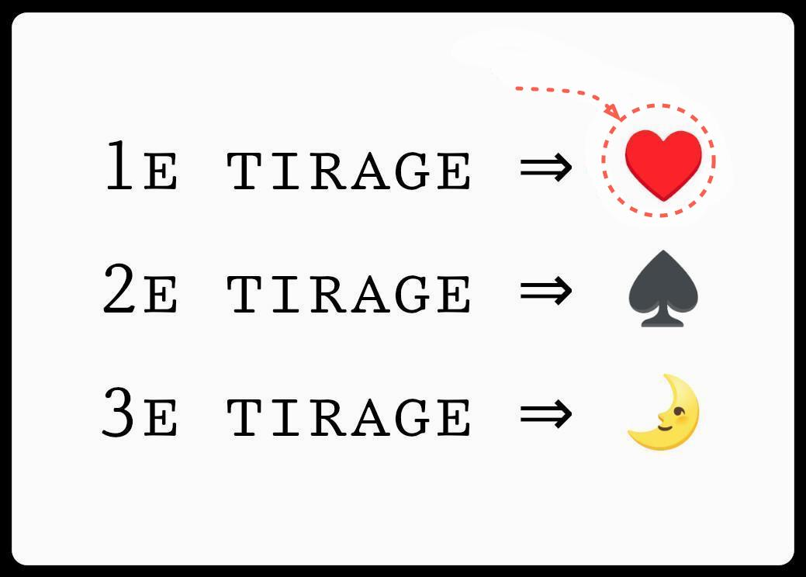
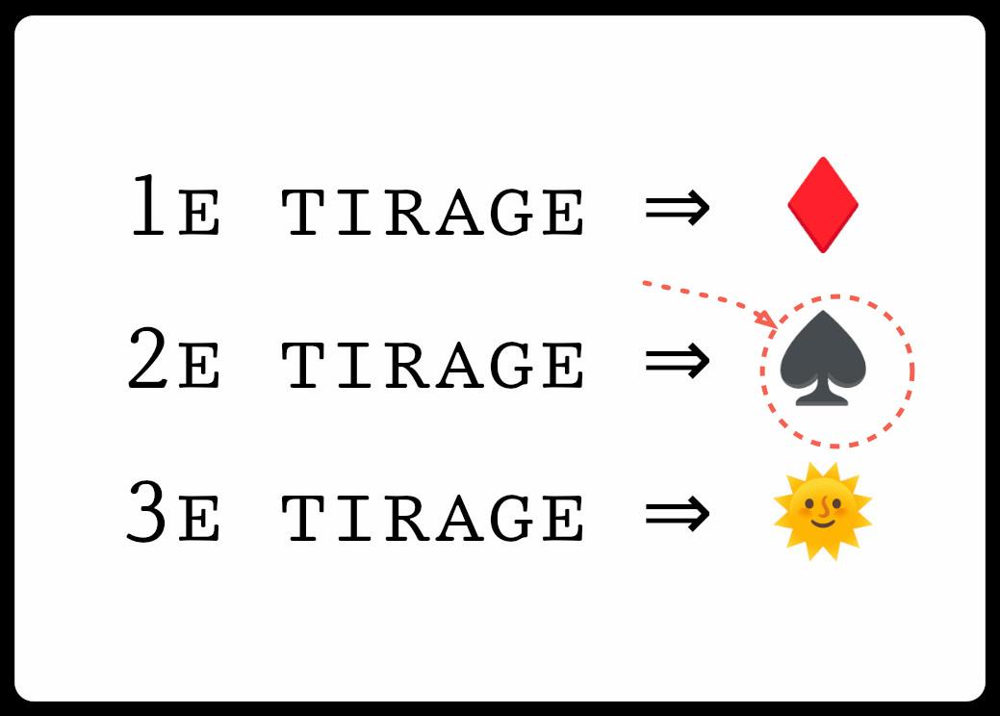
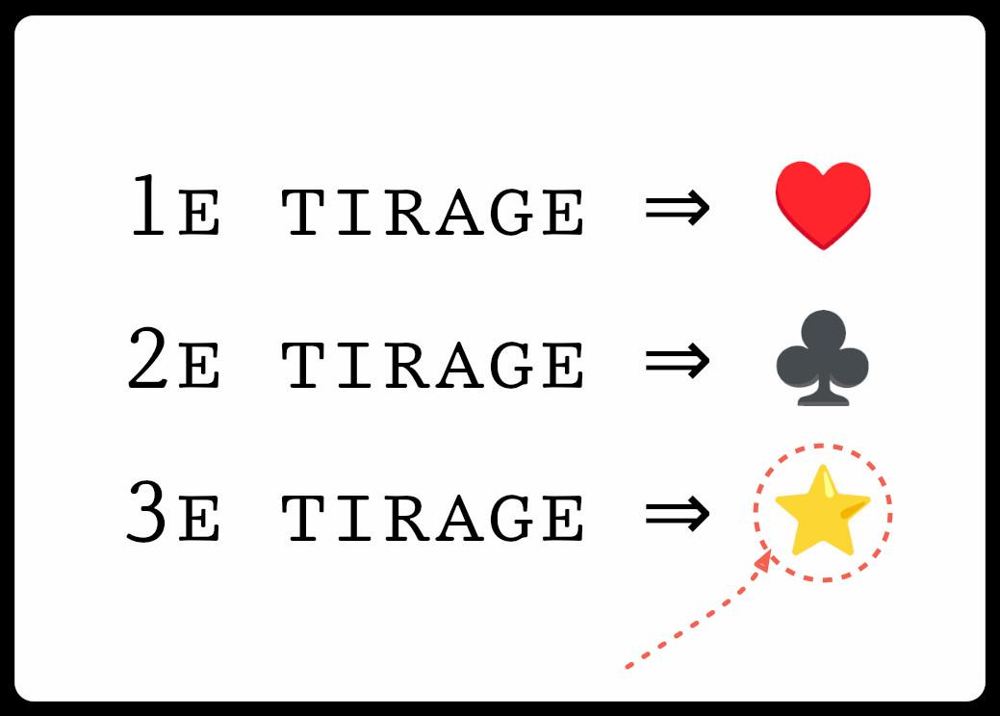
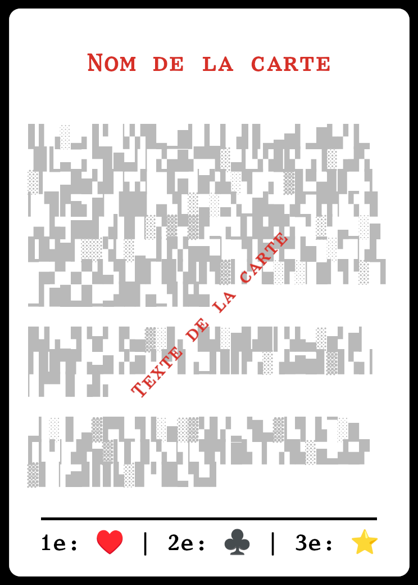
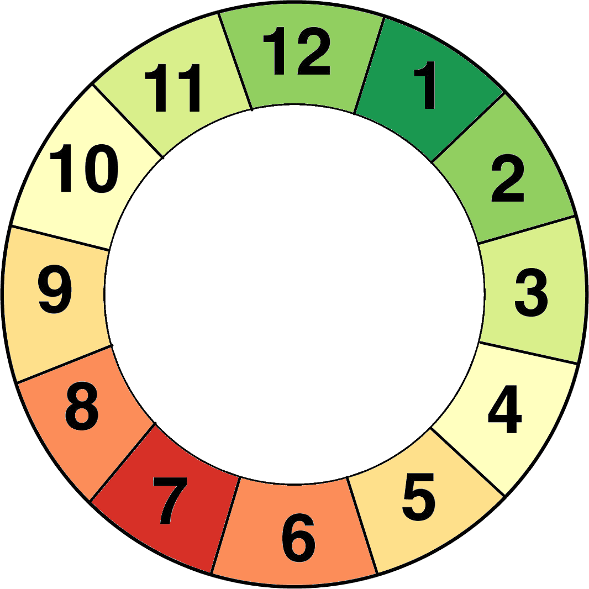

---
title: Reprise de notes en vrac sur une génération de séquence (pseudo-)aléatoire
date: 2025-02-15
modified: 2025-02-16
author: Tạ Minh Lâm
css: simple.min.css
...

Actuellement, on a une méthode pour produire une séquence

- de 2 nombres distincts l'un de l'autre
  (dans l'intervalle 1~3)
- chaque nombre d'une couleur
  (parmi deux)
- plus une couleur aléatoire
  (parmi les même deux)

Les résultats élémentaires disponibles sont donc :

-------------------------------------------------  -------------------------------------------------
[1]{style="background: green;padding: .3em;"}      [1]{style="background: red;padding: .3em;"} 
[2]{style="background: green;padding: .3em;"}      [2]{style="background: red;padding: .3em;"} 
[3]{style="background: green;padding: .3em;"}      [3]{style="background: red;padding: .3em;"} 
[ ]{style="background: green;padding: .3em;"}      [ ]{style="background: red;padding: .3em;"} 
-------------------------------------------------  -------------------------------------------------

<!--
Sous forme de table

1. [1]{style="background: green;padding: .3em;"}, 
2. [1]{style="background: red;padding: .3em;"}, 
3. [2]{style="background: green;padding: .3em;"}, 
4. [2]{style="background: red;padding: .3em;"}, 
5. [3]{style="background: green;padding: .3em;"}, 
6. [3]{style="background: red;padding: .3em;"}, 
7. [.]{style="background: green;padding: .3em;"}, 
8. [—]{style="background: red;padding: .3em;"}, 

-- --  --  -- --
R  1R  2R  3R -R
V  1V  2V  3V -V
-- --  --  -- --

: R = "rouge", V = "vert", "-" = pas de nombre
-->

e.g.

-----------------------------  --------------------------------------
"1 rouge", "3 vert", "vert"     OK
"1 rouge", "1 vert", "vert"     Non, car le "1" apparaît deux fois
-----------------------------  --------------------------------------

Matériellement, on à deux dés à 6 faces marqués ...?, et d'un dé à six faces dont 3 sont rouges et 3 sont vertes.

Je trouve un peu inélégant que les trois dés ne sont ni tous identiques, ni tous distincts.

A noter que chaque séquence produite a la caractéristique utile d'avoir une couleur majoritaire, du fait de sa longueur impaire.

On obtient un total de 12 séquences.

On vise, plus abstraitement, à établir une méthode de sélection aléatoire.

1. dans une liste de ~12 éléments.
2. Cette méthode devrait être à étapes
   (ces étapes servant de source de tension/ suspense)
3. minimiser les ressources matérielles et cognitives requises par
   la procédure

- Clairement, le plus simple pour `1.` et `3.` serait de lancer 1D12.
  Mais cela ne satisferait pas `2.`.

- Une méthode populaire pour le Yi King utilise 3 pièces de monnaie pour
  obtenir aléatoirement une combinaison parmi 8. Plus abstraitement, il 
  s'agit des valeurs binaires de 0 à 8 :

   decimal    binaire
  ---------  ---------
   0            000
   1            001
   2            010
   3            011
   4            100
   5            101
   6            110
   7            111
  ---------  ---------

  Cette méthode satisfait `2.` et `3.`, mais on est alors trop loin des 12 séquences requises.

<!--

  Mais si utilise 3 pieces distinctes, e.g. [🌞, 🌛], [A, B] et [1, 2], on a alors toujours 8 *combinaisons* (i.e.  sans tenir compte de l'ordre), 

  ----------
   🌞, A, 1
   🌞, A, 2
   🌞, B, 1
   🌞, B, 2
   🌛, A, 1
   🌛, A, 2
   🌛, B, 1
   🌛, B, 2
  ----------

  ... mais pour chacune, par exemple 🌞, A, 1, on a 6 *pérmutations* (i.e. en tenant compte de l'ordre):

  ----------
   🌞, A, 1
   🌞, 1, A
   A, 1, 🌞
   A, 🌞, 1
   1, A, 🌞
   !, 🌞, A
  ----------

  Donc un total de 8 × 6 = 48 pérmutations ... beaucoup trop par rapport aux 12 séquences requises.
-->

- Une solution élégante serait d'utiliser trois "dés" distincts:

  - un marqué ♥️, ♥️, ♥️, ♦️, ♦️, ♦️
  - un marqué ♠️, ♠️, ♠️, ♣️, ♣️, ♣️
  - un marqué 🌞, 🌞, 🌛,🌛, ⭐, ⭐

  (ces symboles en exemple n'ont pas d'intéret intrinséque. Ils pourraient être remplacés par n'importe quoi de thématiquement approprié)

  On a bien [♥️,♦️] × [♣️,♠️] × [🌞,🌛,⭐], càd 2×2×3 = 12 séquences distinctes. Cela satisfait `1.` et `2.`. Mais `3.` est discutable. Avec des dés, cela suppose soit de demander aux joueurs ...
  
  - d'aller pécher le bon dés parmis les trois avant le lancer, ...
  - soit de lancer n'importe lequel et de reordonner les résultats après le 3e lancé.

  Si les dés ne sont pas ordonnés, on a bien 12 *combinaisons* (i.e.  sans tenir compte de l'ordre), mais pour n'importe laquelle, e.g ♥️, ♣️, 🌞 on a

  1. ♥️, ♣️, 🌞
  2. ♥️, 🌞, ♣️
  3. 🌞, ♥️, ♣️
  4. 🌞, ♣️, ♥️
  5. ♣️, ♥️, 🌞
  6. ♣️, 🌞, ♥️

  ... 6 *permutations* (i.e. en tenant compte de l'ordre) distinctes. Donc 12×6 = 72 permutations au total.
  Comme on utilise 3 dés distincts, avec 3 séries de symboles distinctes, les joueurs ne peuvent pas intuitivement ordonner les résultats. Ils doivent mémoriser l'ordre des symboles. ou bien se referer à la régle. Dans un cas comme dans l'autre, cela distrait de l'immersion dans le jeu.
  Une alternative supérieure ici pourrait être d'utiliser des cartes plutôt que des dés. Chaque carte, profitant d'une surface d'information plus large, indiquerait un résultat pour chaque série de symboles. Par exemple :

<table>
<tbody>
<tr>
<td>
<figure>

<figcaption>1e carte
</figcaption>
</figure>
</td>
<td>
<figure>

<figcaption>2e carte
</figcaption>
</figure>
</td>
<td>
<figure>

<figcaption>3e carte
</figcaption>
</figure>
</td>
</tr>
</tbody>
</table>

<!--

  -----------------------------------------  ------------------------------  ------------------------------
      
  -----------------------------------------  ------------------------------  ------------------------------
    ----------  ---
    1e tirage    ♥️
    2e tirage    ♠️
    3e tirage    🌛
    ----------  ---
    : 1e carte
  
    ----------  ---
    1e tirage    ♦️
    2e tirage    ♠️
    3e tirage    🌞
    ----------  ---
    : 2e carte
  
    ----------  ---
    1e tirage    ♥️
    2e tirage    ♣️
    3e tirage    ⭐
    ----------  ---
    : 3e carte

-->

  Après avoir tiré ces 3 cartes, on obtient la séquence ♥️, ♠️, ⭐.
  Ce système de carte permet aussi de tirer le jeu dans la direction de "tout avec des cartes" (et un jeu avec peu de types de composants parait sans doute souvent plus "simple", approchable).

  Il est à noter que ce systeme pourrait être compacté pour loger en marge des cartes courantes du jeu. Quelque chose comme ...
  
  {style="width: 20rem;"}

- Une solution légèrement différente serait d'utiliser des cartes dont chacune serait unique, e.g un jeu de 5 cartes [A, B, C, D, E] dont on tirerait 3. Cela donne 10 combinaisons, presque les 12 visées :

  ---------  ---------  ---------
   A, B, C    B, C, D    C, D, E
   A, B, D    B, C, E
   A, B, E    B, D, E
   A, C, D
   A, C, E
   A, D, E
  ---------  ---------  ---------

  Mais chaque combinaison a 6 pérmutations, e.g. pour la combinaison "A, B, C" :
  
  ---------  ---------  ---------
   A, B, C    B, A, C    C, A, B
   A, C, B    B, C, A    C, B, A 
  ---------  ---------  ---------

  Cela donne un total de 10 × 6 = 60 pérmutations ... beaucoup trop.

  Mais si on utilise un jeu de 4 cartes, e.g. [A, B, C, D], on a :

  ---------  ---------
   A, B, C    B, C, D
   A, B, D 
   A, C, D    
  ---------  ---------

  4 combinaisons dont chacune a toujours 6 pérmutations, pour un total de 4 × 6 = 24 pérmutations.
  C'est toujours beaucoup trop, mais il est interessant que 24 = 12 × 2.
  Il est donc possible de simplement donner une même interpretation (en termes d'effets dans le jeu) a 2 pérmutations.

  

- Une autre approche serait d'utiliser une jauge cyclique de 1 à 12 (un cadran d'horloge) avec un ou plusieurs *"exploding dice"* (dont les valeurs minimale et/ou maximale ne sont pas fixes, mais dont les extrêmes sont progressivement statistiquement de moins en moins probables). La propriété d'être "explosif" pourrait être couplée à celle de d'avoir des valeurs négatives et positives[^pink].

   e.g. un dé à six faces marqué "-3", "-2", "-1", "1", "2", "3".
   Sur un résultat de "-3" ou "3", le dé est lancé à nouveau, et le nouveau résultat est ajouté au précédent ...

   L'état initial (qu'on assume ici être plutôt neutre ou positif pour les joueurs, et associé à la valeur 1 et la couleur verte) a ainsi peu de chances d'évoluer beaucoup, mais a une chance non-nulle de bondir radicalement vers le pire (ici associé à la valeur 6 et la couleur rouge).

{style="width: 20rem;"}

[^pink]: Plus abstraitement, on veut produire du "bruit rose". Voir à ce sujet le [speech de Geoff Engelstein (~30min, YouTube)](https://www.youtube.com/watch?v=qXn3tGBztVc).
